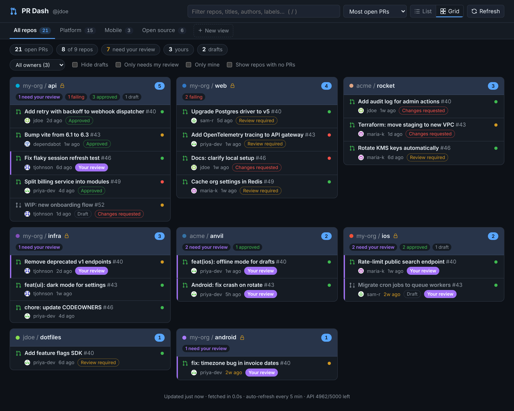
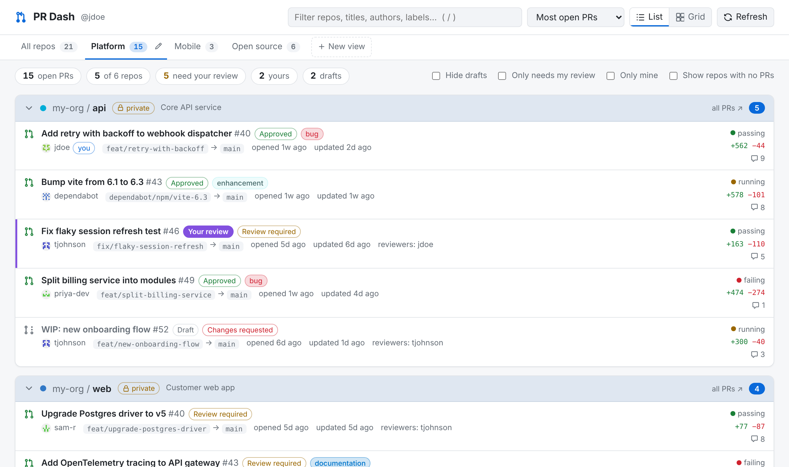

# pr-dash

A small local web dashboard of your GitHub repos and their open pull requests, grouped by repo.



<sub>Screenshots use synthetic data.</sub>

- TypeScript on both the server and the browser, with no dependencies to run: Node 22.18+ runs `.ts` files directly
- Uses your existing `gh` login, so you don't need to create a token
- Shows CI status, review state, "needs your review", drafts, labels, branches, and diff size
- **PR Watcher reviews**: each Grok PR Watcher review with a status (open, partly addressed, addressed, summary only), a nits count, a "new commits" marker, and a per-PR "Ready to merge" indicator
- **Saved views**: named sets of owners/orgs and repos shown as tabs, alongside a built-in **All repos** tab
- **Owner filter**: narrow any view to one user or org
- **List or Grid** layout: grid shows one card per repo
- Filter (`/`), sort, collapse repos, hide drafts, "only mine", "only needs my review"
- Auto-refreshes; the server caches GitHub responses so reloading the page is cheap
- Listens only on `127.0.0.1` by default

## Run it

```bash
cd pr-dash
node --version          # needs v22.18 or newer
gh auth status          # make sure gh is logged in
node server.ts --open   # or: npm run open
```

Then open http://localhost:8787. Stop it with Ctrl+C.

You don't need `npm install` to run it. It's only for type checking and tests:

```bash
npm install && npm run check    # tsc --noEmit, strict
npm test                        # node --test, pure server modules
```

## Views

**All repos** is always there and shows everything the server fetched, including repos it fetched only for your views. Repos you start getting access to show up there automatically.

To make your own view, click **+ New view**, give it a name, and choose what goes in it:

- **Owners & orgs**: click an owner to include all of their repos, including ones created later. You can also type any user or org name, even one outside your usual repos (for example `vercel`), and its repos will be fetched.
- **Individual repos**: tick repos in the list (use the search box to narrow it down), or type `owner/name` or a pattern like `my-org/web-*` and press **Add**. Repos you add by name are fetched even if they aren't yours.

To change or delete a view, open it and click the pencil on its tab. The dashboard remembers the last view and layout you used, so a view like "My repos" acts as a saved filter.

Each view has its own link, `http://localhost:8787/#view=<id>`, so you can bookmark it. Repos you added to a view one by one are always shown, even with no open PRs. Repos that come in through an owner or pattern follow the **Show repos with no PRs** toggle, so a big org doesn't fill the page with empty cards.

**Owner filter.** When a view covers more than one owner, an owner dropdown appears next to the toggles. Use it to narrow the current view to one user or org. Clear it with the **×** on the "owner:" chip.

Views are saved in `views.json` next to `server.ts`; you can also edit that file by hand:

```json
{
  "views": [
    { "id": "platform", "name": "Platform", "owners": [], "repos": ["my-org/api", "my-org/infra", "my-org/*-service"] },
    { "id": "orgs", "name": "Work orgs", "owners": ["my-org", "acme"], "repos": ["your-user/dotfiles"] }
  ]
}
```

## Layouts and shortcuts

Switch between the **List** layout (the original: one wide section per repo, one row per PR) and the **Grid** layout (one card per repo, with counts for needs-review, failing, approved and drafts) using the buttons in the top bar.



| key | action |
| --- | --- |
| `/` | focus the filter (`Esc` clears it) |
| `1`–`9` | switch view (`1` = All repos) |
| `g` | toggle list / grid |
| `r` | refresh from GitHub |

## Watcher reviews

When a PR has a review from a configured bot (by default `grok-pr-watcher[bot]`), its row shows a `Watcher: 3/4 open` badge. The count is open findings over all non-nit findings across that PR's Watcher reviews. Each review, and the PR as a whole, has one of four statuses:

| status | meaning | color |
| --- | --- | --- |
| Open | every non-nit finding is still open | red |
| Partly addressed | some findings open, some resolved; or an older review still has open findings | yellow |
| Addressed | every non-nit finding is resolved | green |
| Summary only | the review has no inline findings | gray |

A finding is a review thread the bot opened. It counts as open until the thread is **resolved** on GitHub. A thread GitHub marks as outdated (the code under it changed) is still open and shows ↻. Findings whose text starts with "Nit" never count toward Open; they get their own gray `2 nits` badge. A `new commits` chip means the PR's head moved since the latest review.

Click **Watcher review** under a row to see the summary (GitHub's rendered markdown, passed through a strict allowlist on the server), the findings with `path:line` links, and earlier reviews.

**Ready to merge** turns green when there are no open findings, GitHub reports the PR as mergeable, CI is passing or absent, it isn't a draft, nobody is requesting changes, and branch protection isn't holding it. Otherwise it's gray and lists what's blocking, for example `2 open findings · CI pending · conflicts`.

Filter with the **Only open Watcher findings** toggle, or type `watcher:open`, `watcher:addressed`, `watcher:partly`, `watcher:summary` or `watcher:none` in the filter box.

Watcher data is fetched in a second, batched GraphQL query only for PRs whose latest reviews include a configured bot, so it costs about one rate-limit point per 20 PRs. Only the first 50 review threads of a PR are checked; a warning appears if there are more. The reviews come from the same `gh` token as everything else, so that token must be able to read each org (`gh api graphql -f query='{repositoryOwner(login:"my-org"){repositories(first:1){nodes{nameWithOwner}}}}'` should return a repo).

## Project layout

```
server.ts            HTTP server, response cache, API routes + request safety, static files
src/config.ts        config.json loading, token resolution (gh / env / macOS Keychain)
src/github.ts        GraphQL queries, pagination, shaping into the dashboard model, batched Watcher fetch
src/botreviews.ts    Watcher status rules and merge blockers (pure, tested)
src/sanitize.ts      allowlist filter for GitHub's rendered bodyHTML (pure, tested)
src/*.test.ts        node --test suites
src/views.ts         views.json load/validate/save
src/types.ts         types shared by server and browser
static/app.ts        browser entry: data loading, tabs, wiring
static/lib/state.ts  UI state, view matching, filtering
static/lib/list.ts   list layout
static/lib/grid.ts   grid layout
static/lib/editor.ts view editor dialog
static/lib/dom.ts    DOM/format helpers
static/lib/watcher.ts Watcher badges, mergeable indicator, review panel
static/index.html, static/style.css
```

The browser loads `/app.ts`, which imports the `static/lib/*.ts` modules. The server removes the types from each `.ts` file with Node's built-in `stripTypeScriptTypes` and sends it as JavaScript, so there's no build step. Two rules keep this working, and `tsconfig.json` enforces them with `erasableSyntaxOnly`:

- Only use TypeScript syntax that can simply be deleted. No `enum`, `namespace` or parameter properties.
- Browser code can import other `static/` modules normally, but can bring in `src/` only as types, using `import type`.

## API

| route | |
| --- | --- |
| `GET /api/prs[?refresh=1]` | dashboard data (cached for `cache_seconds`; `refresh=1` skips the cache) |
| `GET /api/views` | saved views |
| `PUT /api/views` | replace all views; body `{"views": [...]}` |

API requests are only accepted if the Host header is a local name like `localhost` or `127.0.0.1`. This stops a malicious website from using a DNS trick (DNS rebinding) to read your private repo data. Requests that change anything also need a JSON body and an `X-PR-Dash: 1` header, and any `Origin` header has to match the page. Another site can't send those through your browser, so it can't make changes without your knowing. Write actions you add later should use the same checks (`assertWritable` in `server.ts`).

## Configure

```bash
cp config.example.json config.json
```

| key | what it does |
| --- | --- |
| `mine` | Include repos you own, collaborate on, or can see through an org (default `true`). |
| `owners` | Also include every repo under these users or orgs, e.g. `["my-org"]`. |
| `repos` | Also include these specific repos, e.g. `["vercel/next.js"]`. |
| `exclude` | Hide repos by name or glob, e.g. `["my-org/sandbox-*"]`. |
| `include_archived`, `include_forks` | Off by default. Repos listed in `repos` always show. |
| `max_repos_per_source` | Cap per source (most recently pushed first). |
| `prs_per_repo` | Max PRs fetched per repo (1–100); the page links to GitHub for the rest. |
| `cache_seconds` | How long the server reuses a GitHub response. The **Refresh** button skips the cache. |
| `refresh_seconds` | How often the page auto-refreshes. |
| `bot_reviews` | Fetch and show PR Watcher reviews (default `true`). |
| `bot_reviewers` | Bot logins whose reviews count, in GitHub's `[bot]` form (default `["grok-pr-watcher[bot]"]`). |
| `host`, `port` | Where to listen (default `127.0.0.1:8787`). |
| `tokens` | Optional per-owner tokens (see below). |

`config.json` is read again on every fetch, so edits apply on the next refresh (`host` and `port` need a restart). A different config path can be set with `PR_DASH_CONFIG=/path/to/config.json`.

With no config file, it shows every repo you own, collaborate on, or can see through an org you belong to, up to 200 of the most recently pushed.

## Auth

Tokens are found in this order:

1. `GITHUB_TOKEN` or `GH_TOKEN` environment variable
2. `gh auth token` (the default for this project)

The token stays in the Node process and is never sent to the browser.

**Optional per-owner tokens.** To use a different token for one org, add it to `tokens`. Raw tokens aren't accepted in the config file, so it only says where to find the token:

```json
"tokens": {
  "default": "gh",
  "my-org": "keychain:pr-dash-my-org"
}
```

Supported specs are `"gh"`, `"env:VAR_NAME"`, and `"keychain:SERVICE"` (macOS Keychain). To save a token to the Keychain: `security add-generic-password -a "$USER" -s pr-dash-my-org -w`.

## Start it automatically at login (optional)

Save as `~/Library/LaunchAgents/com.example.pr-dash.plist`, then run `launchctl load ~/Library/LaunchAgents/com.example.pr-dash.plist`. Change the `node` path to match `which node`:

```xml
<?xml version="1.0" encoding="UTF-8"?>
<!DOCTYPE plist PUBLIC "-//Apple//DTD PLIST 1.0//EN" "http://www.apple.com/DTDs/PropertyList-1.0.dtd">
<plist version="1.0">
<dict>
  <key>Label</key><string>com.example.pr-dash</string>
  <key>ProgramArguments</key>
  <array>
    <string>/opt/homebrew/bin/node</string>
    <string>/Users/YOU/path/to/pr-dash/server.ts</string>
  </array>
  <key>EnvironmentVariables</key>
  <dict>
    <!-- so launchd can find gh -->
    <key>PATH</key><string>/opt/homebrew/bin:/usr/local/bin:/usr/bin:/bin</string>
  </dict>
  <key>RunAtLoad</key><true/>
  <key>KeepAlive</key><true/>
  <key>StandardErrorPath</key><string>/tmp/pr-dash.log</string>
</dict>
</plist>
```

## GitHub Enterprise

Set `GITHUB_GRAPHQL_URL=https://github.example.com/api/graphql` (and a token for that host).

## Ideas / next steps

- **Write actions** (approve, merge, re-run checks, add a label). The `gh` token already has the scopes for these. Add them as routes in `server.ts` that call `assertWritable()`.
- Desktop notification when a new PR asks for your review.

## License

MIT. See [LICENSE](LICENSE).
